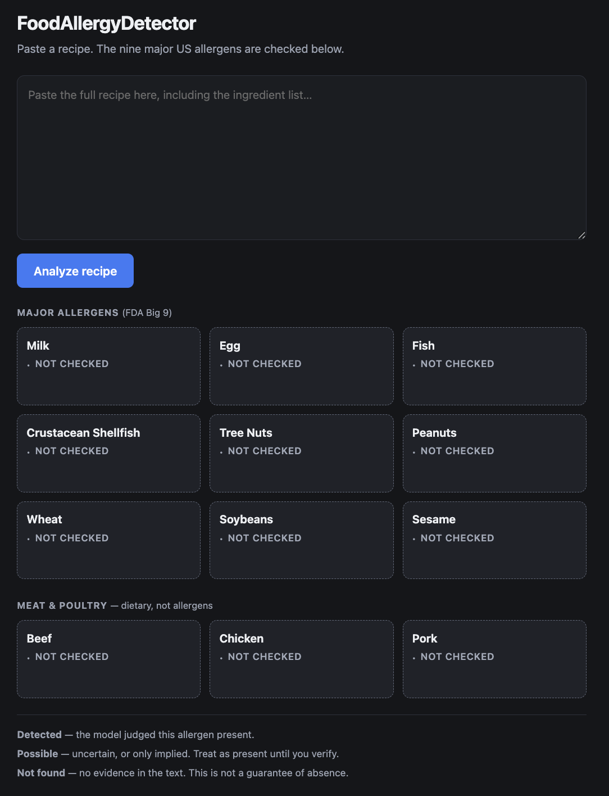

# FoodAllergyDetector

Paste a recipe and see which of the nine major US allergens it contains, plus
beef, chicken and pork for dietary restrictions. A single page, a small Python
backend, and TypeSafe's Jev model doing the judging.

> **Supplemental check only.** This is not a primary source for allergen
> information. Always read product labels and ask the kitchen or manufacturer.
> An allergen can be present without appearing anywhere in the recipe text.

## Live

<https://faas-sfo3-7872a1dd.doserverless.co/api/v1/web/fn-a6ef956d-73a5-4702-b7c9-d9286272d233/app/http>

Running on DigitalOcean Functions. The first request after a period of
inactivity takes a few seconds while the container starts.

## Visuals



Flagged items show which ingredient was responsible, or note that the allergen
is implied by a named dish rather than listed.

## Installation

Requires Python 3.12 and a TypeSafe API key.

```bash
python3 -m venv .venv
./.venv/bin/pip install -r requirements.txt
echo 'TYPESAFE_API_KEY=your_key_here' > .env
```

## Usage

```bash
./.venv/bin/uvicorn main:app --reload --host 0.0.0.0 --port 8000
```

Open http://localhost:8000. Use `--host 0.0.0.0` to reach it from another
device on the same network, or drop it to bind localhost only.

### API

```
GET  /api/allergens     the checklist definitions
POST /api/analyze       {"recipe": "..."} -> per-item status and source
```

Each item comes back as `detected`, `possible`, or `clear`. Anything not
flagged should be treated as unchecked rather than absent.

## How it works

Three separate requests per analysis, deliberately not merged:

1. **Allergens** — one yes/no question per allergen, asked together.
2. **Meats** — beef, chicken, pork. Not allergens; dietary restrictions. Sent
   as its own request so the allergen questions stay untouched.
3. **Sources** — a follow-up question over candidate ingredients, asked only
   for items already flagged. Attribution can never change a detection.

Question wording carries most of the weight. Each one spells out what counts as
a yes and what counts as a no, so that free-from substitutes ("dairy-free
butter") are not read as the thing they replace.

If the model cannot be reached, `fallback.py` does offline keyword matching and
the page shows a prominent warning. The fallback is weaker by design: it reads
the words in the recipe and cannot recognise allergens implied by a dish name.
Unmatched tiles read "No keyword match", never "Not found".

## Deployment

### DigitalOcean Functions

```bash
doctl serverless install
doctl serverless connect <label> --access-key dof_v1_<id>:<secret>
scripts/stage_functions.sh --deploy
```

`scripts/stage_functions.sh` assembles a self-contained package under `.stage/`,
since `doctl serverless deploy` uploads only the project directory and the
function cannot import modules from the repository root.

Two settings are not optional. `web: raw`, because the default parses the
request body into event keys and destroys the bytes an ASGI app needs. And
`--remote-build`, because compiled wheels must be built for the Linux runtime.
The runtime is pinned to `python:3.11`; `python:default` is older than this
app's dependencies support.

### DigitalOcean App Platform

```bash
doctl apps create --spec .do/app.yaml
```

Set `TYPESAFE_API_KEY` in the App Platform console. It is declared in the spec
as a secret with no value, so the key is never committed.

## Project structure

| path | |
|---|---|
| `main.py` | FastAPI server and the request flow |
| `allergens.py` | The nine allergens, three meats, and their questions |
| `sources.py` | Ingredient attribution |
| `ingredients.py` | Ingredient vocabulary used to propose candidates |
| `vocabulary.json` | Bulk vocabulary terms (ODbL v1.0, see below) |
| `fallback.py` | Offline keyword detection |
| `static/index.html` | The single page |
| `functions/`, `.do/`, `scripts/` | Deployment |

## Data and attribution

Ingredient vocabulary is derived in part from **Open Food Facts**
(<https://openfoodfacts.org>), used and redistributed under the **Open Database
License v1.0**. Open Food Facts does not guarantee the accuracy of its data.

`vocabulary.json` is a derived database and is shared here under those same
terms. The application code is unaffected: ODbL covers the database, not the
program that reads it.

## Limitations

- The vocabulary is not domain-validated and leans European in coverage.
- Attribution names the ingredient judged most responsible; it is not a
  complete list of every contributing line.
- The fallback's keyword lists are separate from the allergen definitions and
  can drift from them.
- Nothing here is a substitute for reading the label.

## License

Code is released under the [MIT License](LICENSE).

The MIT License covers the software only. `vocabulary.json` is a derived
database under the Open Database License v1.0 and keeps those terms, as
described in "Data and attribution" above.

## Status

Personal project. Not accepting contributions.
